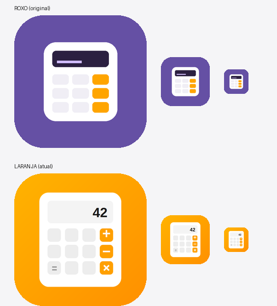

# Identidade visual do CalcDroid

Este diretório guarda material de design. **Nada aqui entra no build** — o
Gradle só compila recursos sob `app/src/*/res`, então os arquivos deste
diretório servem de arquivo histórico e referência.



## Laranja — identidade ativa

É a que o app publica hoje. Os arquivos ficam nos lugares de sempre:

| O quê | Onde |
| --- | --- |
| Arte de origem (calculadora recortada, RGBA) | `tools/icon_glyph.png` |
| Fundo em degradê e ícone temático | `app/src/main/res/drawable/` |
| Camada de frente do adaptive icon | `app/src/main/res/mipmap-*/ic_launcher_foreground.png` |
| Ícones legados (pré-API 26) | `app/src/main/res/mipmap-*/ic_launcher{,_round}.png` |
| Ícone da ficha da loja e gráfico de destaque | `play-store/` |
| Geradores | `tools/generate_launcher_icon.py`, `tools/generate_feature_graphic.py` |

Paleta: degradê diagonal `#FFB300` → `#FF9000`, corpo branco, teclas
`#E8E8E8`, operadores `#FFA500`.

## Roxa — arquivada em `identidade-roxa/`

Foi a identidade até a versão 1.14. A 1.15 trocou o ícone para laranja, mas
o ícone 512×512 e o gráfico de destaque da loja ficaram para trás em roxo
por um tempo, o que gerou uma inconsistência já corrigida. O conjunto
completo está preservado aqui, recuperado do commit `f5df96d`.

Paleta: fundo `#6550A4` (Purple40, a cor semente padrão do Material 3),
corpo `#FFFFFF`, visor `#2B2040`, brilho `#D0BCFF`, teclas `#F0EEF5`,
operadores `#FFA500`.

O contraste interno dela é melhor que o da laranja: roxo e laranja são quase
complementares, então as teclas de operador saltam. Na identidade laranja
atual esse destaque se perde, porque as teclas têm a mesma matiz do fundo —
vale ter isso em mente numa eventual revisão do ícone.

### Atenção aos scripts arquivados

`identidade-roxa/tools/` contém os geradores da época. Eles escrevem em
`app/src/main/res/` e `play-store/`, ou seja, **rodá-los substitui a
identidade laranja ativa pela roxa**. Use-os apenas se a intenção for
exatamente essa.

### Para restaurar a identidade roxa

```bash
cp -r design/identidade-roxa/res/. app/src/main/res/
cp -r design/identidade-roxa/play-store/. play-store/
```

Depois remova `app/src/main/res/mipmap-*/ic_launcher_foreground.png` e
`app/src/main/res/drawable/ic_launcher_monochrome.xml`, que pertencem só à
identidade laranja, e ajuste `mipmap-anydpi-v26/*.xml` — a versão roxa usa
`@drawable/ic_launcher_foreground` como camada de frente, não `@mipmap/`.
